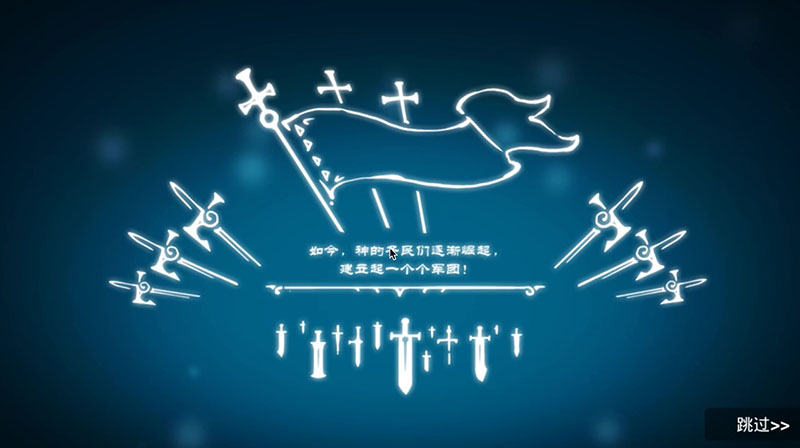
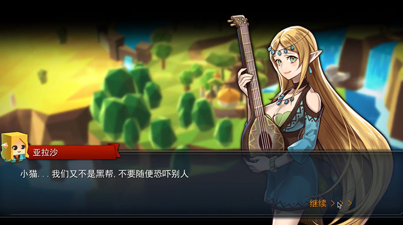
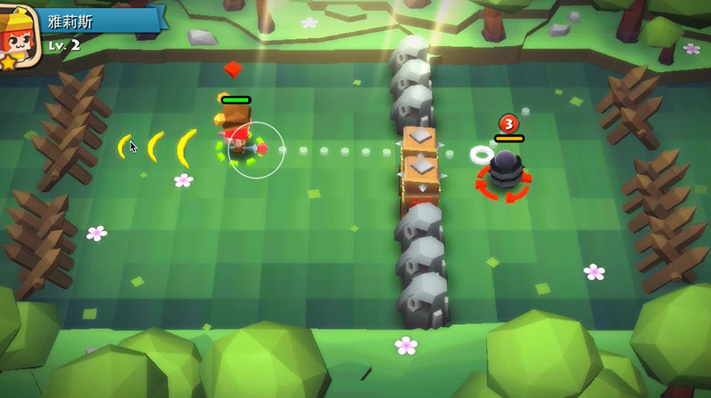
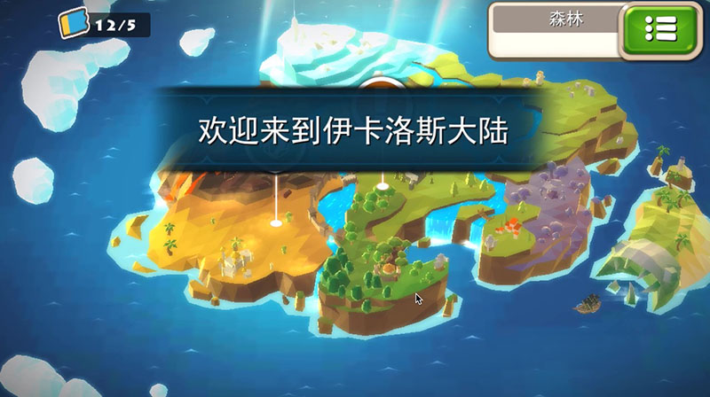
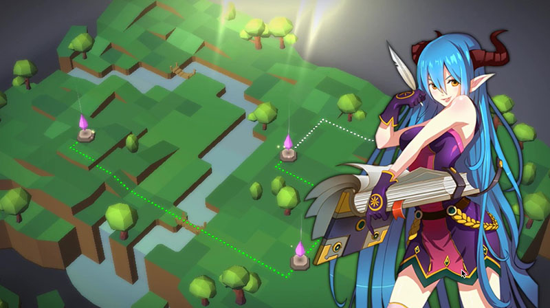
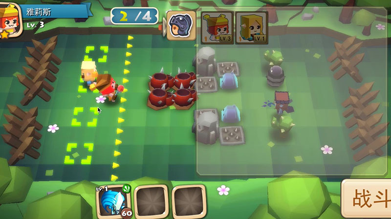

# 萌神弹斗士

**时间：** 2014/12 – 2015/07  
**公司：** 上海东方明珠迪尔希文化传媒 (OPD2C)  
**技术：** [IDE] Unity 5.x；[Language] C#  
**状态：** 商务版

3D Low Ploy风格的大型动作策略类项目，异步对战，类似SuperCell的部落冲突（COC），但是游戏系统设计的丰富程度远甚于COC，富有宏大愿景。

商务版开发时间大概7个月，在对外商务接洽中取得不错的口碑。

后来由于资方组织架构的重大调整和规划管理上的一些原因，团队后来重组了。

