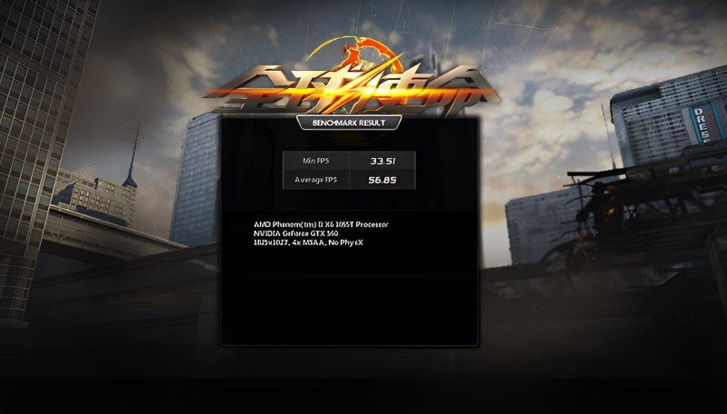
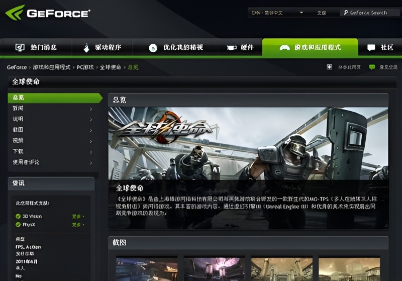
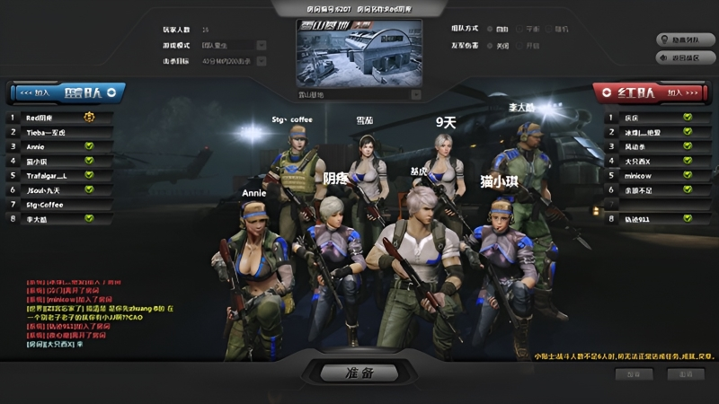
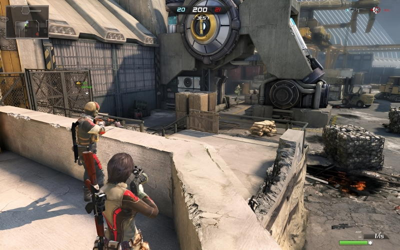

# 全球使命 [Project-Mars]

**时间：** 2010/10 - 2013/06  
**公司：** 上海英佩数码 (EpicGamesChina)  
**技术：** [IDE] UnrealEngine 3，Flash Pro； [Language] UnrealScript，ActionScript2.0  
**状态：** 上线（[https://qqsm.zygames.com/](https://qqsm.zygames.com/)）

全球使命，作为一款次世代大型第三人称TPS射击网游，发行欧美与东南亚多国，2010年开始上线测试运营，如今已超过10个年头。

早期UI系统采用传统的做法，美术需要在图集上标好图素的坐标，然后程序从对应的区域读取像素。 我加入团队后，决定采用新的UI解决方案Scaleform来开发。但是需要采用兼容的方式过渡，新UI需求使用新的技术方案，待版本稳定下来再逐步把老版本的UI替换为新的方案（由于妥协于市场运营的原因，后来版本质量下滑的严重）。

PS：此时的UE3整合Scaleform的版本采用Actionscript2.0作为开发语言，制作流程上并不友好（2.0和3.0的区别是全面的，除了语言本身，对工作流也是如此）。

宣传视频（2014）：[点击观看](Mars/publicity.mp4)

