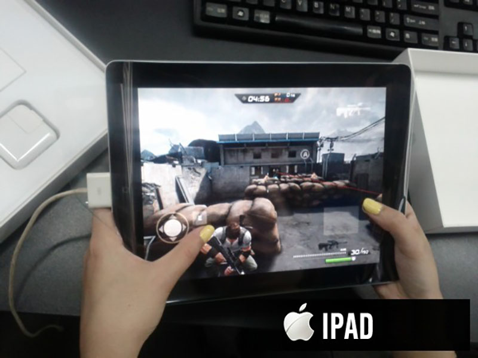
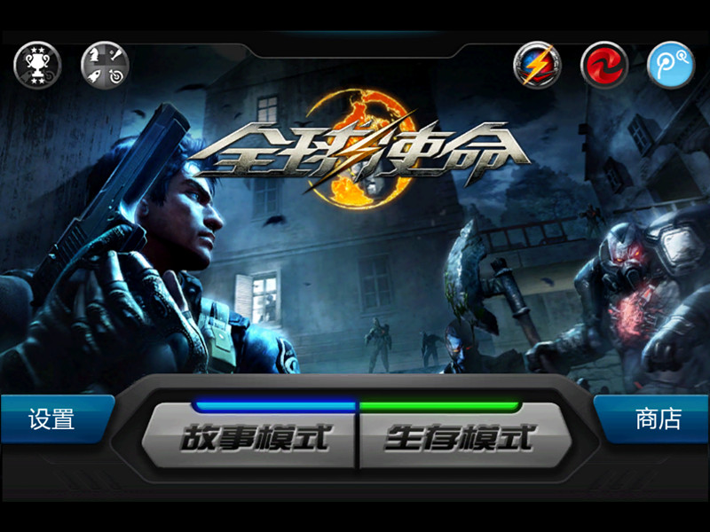
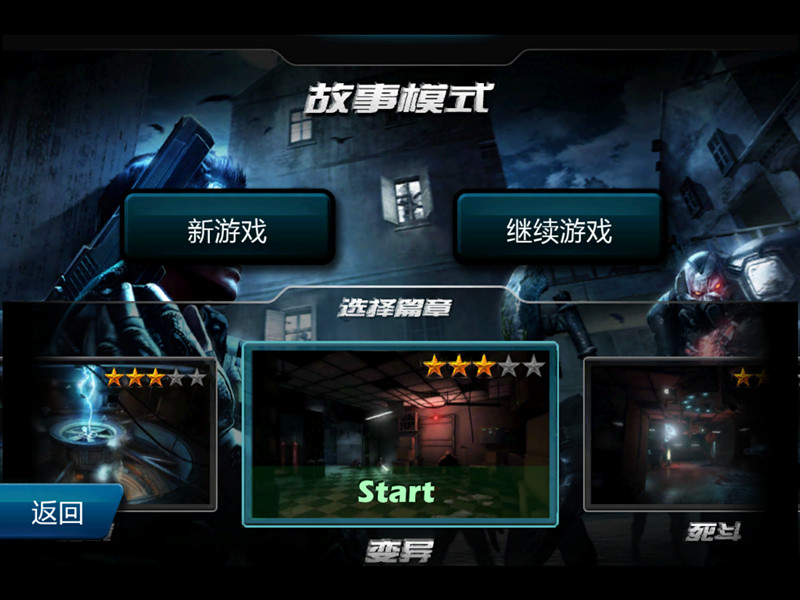
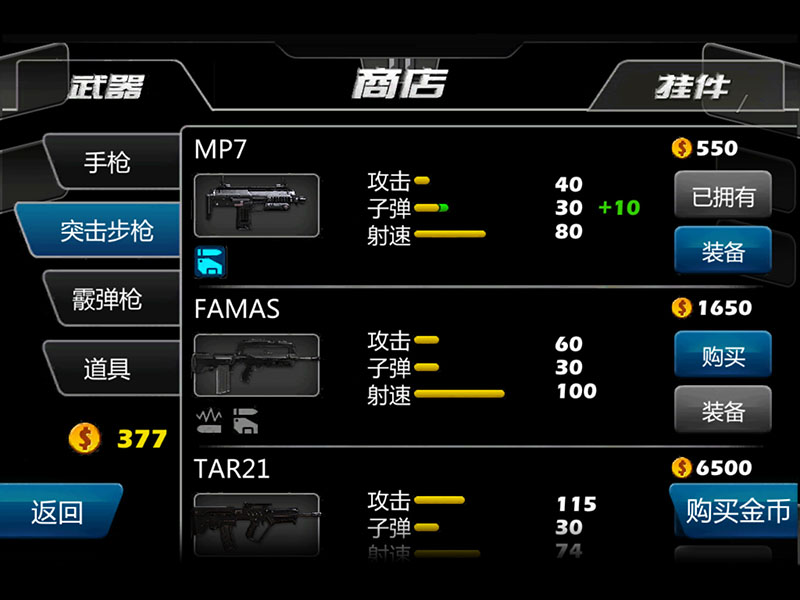
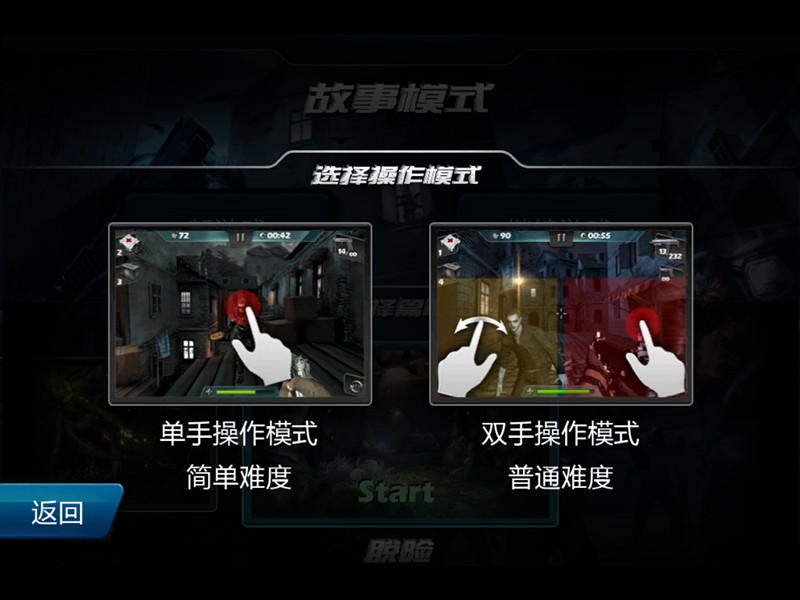
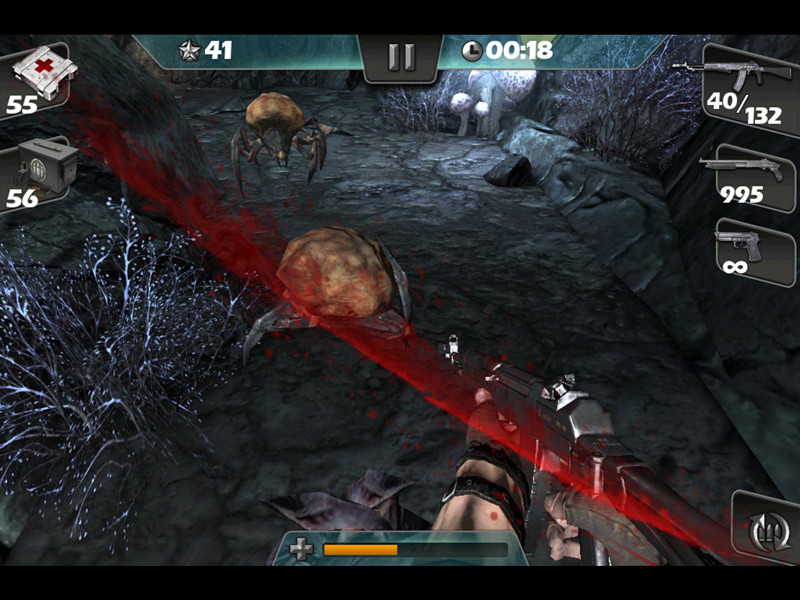

# 全球使命-移动版 [Project-Phobos]

**时间：** 2013/01 – 2013/04
**公司：** 上海英佩数码 (EpicGamesChina)  
**技术：** [IDE] Unreal Engine 3，Flash Pro，Scaleform；[Language] UnrealScript，C++，ActionScript 2.0  
**框架：** [LowoUI-AS](https://github.com/loywong/LowoUI-AS)，[Batcher-JSFL](https://github.com/loywong/Batcher-JSFL)（批处理脚本）  
**状态：** 上线-Global

全球使命的IOS版本，单机剧情类型，目前已不支持国区下载。系统兼容：iPhone、iPod、touch和iPad。 所有UI皆采用Flash制作，通过Scaleform集成（此时仍以ActionScript2.0作为开发语言）。

PS：英佩数码的项目都是以星球命名，作为Mars的衍生项目，这个火卫一的名字就取的很恰如其分，不过据了解后来并没有一个叫做Deimos的项目XD。

